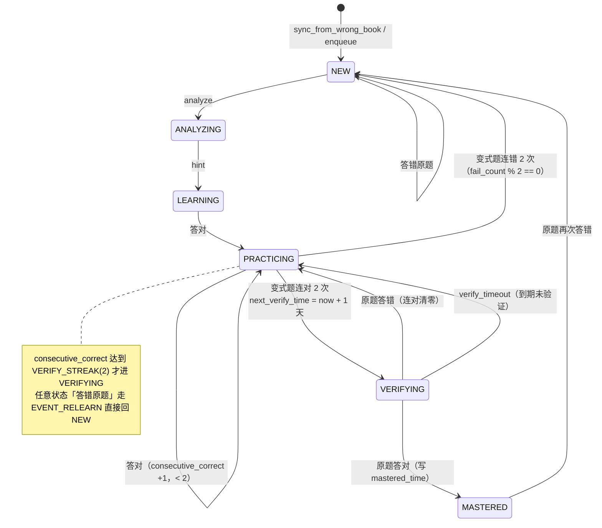

# 架构说明（ARCHITECTURE）

**Current Product: 菲比同学**
**Current Version: V2.6**
**最近一次架构变化：V2.6** —— 新增儿童体验层（首页聚合接口 / 统一 LearningSession / 知识地图 / 成长中心 / 挑战中心 / 分龄 UI 与 Design Tokens）。**未新增数据表、未新增列、未改动任何学习算法**；V2.0~V2.5 的七套引擎保持原样。

本文是《菲比同学》（AI小学学习系统）的整体架构文档：模块分层、数据模型、API 清单、学习流程、技术栈与本地运行方式、验证方式。文档只描述**当前代码里真实存在**的模块、函数、表、字段与路由；不含开发日志与操作记录。

- 定位代码的**唯一入口**是 `docs/MODULE_MAP.md`（能力 → 文件 → 入口 → 表 → 验证套件）。
- 项目硬规则见 `AI_RULES.md`；V2.5 冻结接口契约见 `SPEC.md`；长期记忆见 `PROJECT_CONTEXT.md`。
- 每个 `.py` 文件前 8 行是**模块契约卡**（`# 能力契约｜` / `# 入口：` / `# 依赖：` / `# 不负责：` / `# 验证：` / `# 被调用：` / `# 索引：`），由 `backend/check_cards.py` 静态门禁。

---

## 1. 系统定位
面向小学 1~6 年级学生的**本地单机**自适应学习系统，两个孩子（默认「朵朵」「童童」，`student_id` = 1 / 2）在一台电脑上各学各的数学 / 语文 / 英语。V2.6 起产品名统一为**菲比同学**，儿童端打开就是「今天」。

- 纯本地：SQLite 单文件库 + 硬编码题库/知识点树/规则算法，**没有 DeepSeek Key 也能完整使用**（自动走内置兜底题与规则提示）。
- 零构建前端：原生 HTML + CSS + JavaScript，无 npm、无 bundler、无 CDN，由后端以 `/app` 静态挂载。
- 无账号系统：所有数据按 `student_id` 归属（A=1 / B=2），接口无鉴权（家庭自用，不可暴露公网）。
- 完整链路：能力诊断 → 知识掌握建模 → 错因分析 → 自适应出题与每日任务 → 间隔复习防遗忘 → **错题康复**（V2.5）→ **主动回忆**（V2.5）→ **每日学习总结与习惯统计**（V2.5）。
- **V2.6 儿童端目标**：让孩子**自己**每天能用——打开只看到「今天要做什么」，点一次「开始今天的学习」连续走完当天微任务，做完进入明确结束点直接休息。孩子不需要理解 `mastery_score` / `stability` / `forgetting_risk` / `difficulty_score`，儿童端一律用 🌱🌿🌳⭐ 表达。
- **五句原则（长期有效，原文记录）**：
  1. 菲比同学儿童端优先帮助儿童完成学习，而不是最大化使用时长。
  2. 孩子应该期待明天再来，而不是今天停不下来。
  3. 奖励真正学习，不奖励单纯在线。
  4. 学习过程中减少干扰，完成后集中提供成长反馈。
  5. 每日学习必须存在明确结束点。
---

## 2. 模块结构（分层）

### 2.1 分层视图

```
┌──────────────────────────────────────────────────────────────┐
│ 前端层  frontend/*.html + 同名 *.js + style.css（原生，零构建）  │
├──────────────────────────────────────────────────────────────┤
│ 接口层  FastAPI 路由：main.py 核心闭环 + 各 *_routes.py 的 router │
├──────────────────────────────────────────────────────────────┤
│ 算法/业务层（纯函数优先，可离线单测）                              │
│   stages / ability / mastery / error_analysis / grading /     │
│   validator / srs / auto_ability                              │
│   子包门面：adaptive/ · review/ · recovery/                     │
├──────────────────────────────────────────────────────────────┤
│ 持久化层  database.py（engine / Session / ensure_schema /       │
│           migrate_data / get_db） + models.py（schema 唯一真相） │
├──────────────────────────────────────────────────────────────┤
│ 外部服务  DeepSeek HTTP API（可选，deepseek.py / ai_recovery.py /│
│           phoebe_ai.py 三个消费点，全部有本地降级）                │
└──────────────────────────────────────────────────────────────┘
```

关键边界：

- **前端**只做渲染与交互，不含业务规则，`GET /question` 不下发答案与解析。
- **接口层**只做参数校验与编排，算法交给纯函数模块；所有接口按 `student_id` 过滤。
- **业务逻辑**（判分、阶段判定、掌握度、复习调度、题目审核、康复状态机、习惯统计）全部可在无网络下运行。
- **持久化**一律经 SQLAlchemy ORM；数据库只能**新增表 / 新增列**，迁移幂等。
- **外部服务**只有 DeepSeek；任何失败都必须降级到本地题库 / 规则 / 兜底文案。

### 2.2 应用装配

| 文件 | 职责 |
|---|---|
| `backend/main.py` | 创建 FastAPI 应用（`FastAPI(title="菲比同学 V2.6")`）、注册 CORS 与 15 个 router（核心闭环 + diagnostic / knowledge / adaptive / review / ability / phoebe / recovery / task / habit / active_recall / daily / home / knowledge_map / growth / challenge）、挂载 `/app` 静态目录；实现核心闭环 API `home` / `students` / `question` / `submit` / `reviews`；`GET /` 返回 `version="2.6"`；建表、`ensure_schema`、`migrate_data`、`init_default_users`、`knowledge_tree.ensure_seeded` / `link_mastery`、`error_analysis.backfill` 在 **import 期**执行 |
| `backend/database.py` | `engine` / `SessionLocal` / `get_db`（每请求会话）、`ensure_schema`（按 `PRAGMA table_info` 补列）、`migrate_data`（幂等 UPDATE） |
| `backend/models.py` | **23 张表**的模型定义，schema 唯一真相 |
| `backend/local_users.py` | `init_default_users`：首次启动写入「朵朵」「童童」（旧默认名「小朋友A/B」启动时幂等改名，不删数据） |
| `backend/verify_all.py` | 全量验证编排：`SUITES` 字典 + `main(argv)`，串行跑各套件、独立端口与临时库，输出 `RESULT: ALL PASS` / `HAS FAILURES` 与退出码 |

### 2.3 能力阶段与诊断

| 文件 | 职责 | 对外入口 |
|---|---|---|
| `backend/stages.py` | **能力阶段唯一来源**：72 个能力阶段（每年级 12 块，1.1~6.12；等级名 基础/熟练/进阶/挑战）、0~71 线性坐标、难度值 15~95、三科×72 知识点、阶段升降函数；`legacy_key` 兼容旧 24 阶段题库 | `all_keys`、`normalize_key`、`key_of`、`index_of`、`label`、`difficulty_of`、`knowledge_of`、`next_key`、`prev_key`、`advance`、`stars`、`legacy_key` |
| `backend/ability.py` | 由答题记录算能力阶段与下一题难度 | `calculate_stage`、`next_difficulty` |
| `backend/diagnostic.py` | 阶段化动态诊断状态机与评分（纯函数） | `new_state`、`record_answer`、`evaluate_stage`、`calculate_ability`、`build_report` |
| `backend/diagnostic_bank.py` | 分阶段诊断题库（数学程序化生成，语文/英语取 bank_*） | `build_question`、`bank_size` |
| `backend/bank_chinese.py` / `backend/bank_english.py` | 语文 / 英语分阶段题库数据体 | 题库常量 |
| `backend/diagnostic_routes.py` | 诊断 REST 接口（prefix `/api/diagnostic`） | `start`、`next_question`、`submit_answer`、`session_detail`、`profiles`、`report`、`list_stages` |
| `backend/auto_ability.py` | **V2.5** 训练成绩自动能力推断（纯函数 + 只读统计），不再要求额外做专门诊断 | `subject_profile`、`overall_profile`、`profile_for`、`confidence_text` |
| `backend/ability_routes.py` | `GET /api/ability/auto/{student_id}`（只读，不写任何表） | `router` |

约束：诊断答题**只写诊断表**（`diagnostic_sessions` / `diagnostic_records`），不写 `answer_records`、不改 `abilities`，避免污染日常练习统计。

### 2.4 知识掌握、错因与错题本

| 文件 | 职责 | 对外入口 |
|---|---|---|
| `backend/knowledge_tree.py` | 三科 **139 节点**知识点树（3 科目根 + 19 章节领域 + 72 知识点 + 45 子知识点）、启动灌库、与掌握度关联 | `seed`、`ensure_seeded`、`link_mastery`、`node_rows`、`domains_for`、`path_of`、`all_names`、`difficulty_of` |
| `backend/mastery.py` | 掌握度模型（加权正确率 + 题量收缩 `SHRINK_K=7.5` + 连错惩罚 + 复习加成 + 时间衰减），**每次按全部历史重算** | `MasteryEngine.calculate_mastery` / `level_of` / `confidence_of` / `next_review_time`、`DEFAULT_ENGINE` |
| `backend/error_analysis.py` | 规则优先的错因判定（离线、瞬时），可选 AI 深化 | `analyze`、`rule_analyze`、`ai_analyze`、`summary`、`dominant_error`、`backfill` |
| `backend/wrong_book.py` | 错题本状态机 NEW → LEARNING → MASTERED（`MASTER_STREAK=2`） | `record_wrong`、`record_correct`、`items_for`、`stats_for` |
| `backend/knowledge_routes.py` | 掌握度明细与报告、错因统计与 AI 深化、错题本查询、知识点树与重新灌库 | `update_mastery`（掌握度**唯一写入口**）、`mastery_detail`、`knowledge_report`、`errors`、`analyze_error`、`wrong_questions`、`knowledge_tree_api`、`knowledge_sync` |

### 2.5 出题、审核与判分

| 文件 | 职责 | 对外入口 |
|---|---|---|
| `backend/deepseek.py` | 调用 DeepSeek 生成题目与错因分析；`_load_key()` 手动解析 `backend/.env`，`KEY` 在 import 期求值一次 | `generate_question`、`analyze_error`、`ability_block`、`generate_review_question` |
| `backend/validator.py` | 题目质量审核（格式 / 答案 / 难度 / 知识点 / 歧义），error 级拦截 | `QuestionValidator.validate` |
| `backend/grading.py` | 服务端答案归一化与判定 | `is_correct`（判分**唯一真相**）、`normalize`、`parse_options`、`parse_acceptable` |
| `backend/srs.py` | V2.1 艾宾浩斯间隔阶梯（11 级：5 分钟 → 120 天），答对连续 3 次升一级（`STREAK_TO_ADVANCE=3`），答错回阶段 0 | `review`、`apply_state`、`due_items`、`select_knowledge`、`state_from_row`、`mastery`、`is_due` |

### 2.6 自适应学习引擎（V2.3，子包 `backend/adaptive/`）

| 文件 | 职责 |
|---|---|
| `adaptive/strategy.py` | 知识点优先级排序 + 知识依赖表（三科共 69 条边）+ 依赖门控 |
| `adaptive/difficulty.py` | 难度动态调整：连对 5 题 +5、连错 3 题 −10、最近 10 题 ≥90% 提升阶段 / <50% 降低阶段；难度恒在 1~100 |
| `adaptive/selector.py` | 下一题推荐：40% 薄弱度 + 30% 能力匹配 + 20% 遗忘风险 + 10% 随机探索 |
| `adaptive/planner.py` | 每日计划的时间/题量分配与幂等落库（`DEFAULT_MINUTES` / `MIN_MINUTES` / `target_count_of` / `date_text`） |
| `adaptive/engine.py` | 门面（**唯一碰数据库的自适应模块**）：`AdaptiveLearningEngine.profile` / `decision_for` / `next_spec` / `start` / `feedback` / `plan` / `recommend` / `log`、`DEFAULT_ENGINE` |
| `adaptive_routes.py` | `/api/learning/*` |

约束：**难度状态不落库**——连对/连错与最近 10 题正确率全部由 `answer_records` 现算，避免状态表与实际记录不一致。

### 2.7 间隔复习系统（V2.4，子包 `backend/review/`）

| 文件 | 职责 |
|---|---|
| `review/memory.py` | `MemoryState`：记忆强度、稳定性、个人难度、成熟度六级（含儿童文案与知识森林字段） |
| `review/forgetting.py` | `ForgettingRiskEngine`：遗忘风险 0~1 与高/中/低分级 |
| `review/interval.py` | `calculate_next_interval()`：**两段式**——前 4 次成功走阶梯 1/3/7/14/30，之后稳定性驱动（GOOD ×1.4 / EASY ×1.8 / HARD ×1.0 / 答错 ×0.35，恒在 1~180 天） |
| `review/scheduler.py` | `ReviewScheduler`：P0 到期 / P1 高风险 / P2 早期巩固 / P3 重要基础；每科 ≤8、每天 ≤15、每知识点 1~3 题 |
| `review/selector.py` | `ReviewQuestionSelector`：50% 同知识点换数字 / 30% 变式 / 20% 迁移 + 重复检测 `is_duplicate` |
| `review/mix.py` | `calculate_daily_mix` / `split_counts`：新学 / 补强 / 复习的每日配比 |
| `review/engine.py` | 门面（**唯一碰数据库的复习模块**）：`ReviewEngine.today` / `review_question` / `submit_review` / `memory_map` / `record_learning` / `ensure_states`、`DEFAULT_ENGINE` |
| `review_routes.py` | `/api/review/*` |

约束：复习答题**也写 `answer_records`** 并调用 `knowledge_routes.update_mastery`，与日常练习共用同一套掌握度/错因/错题本链路。今日队列按天缓存（`review_queue`），同一天不重排，需强制重排用 `?refresh=true`。

### 2.8 错题康复系统（V2.5，子包 `backend/recovery/`）

| 文件 | 职责 | 对外入口 |
|---|---|---|
| `recovery/__init__.py` | 子包分工表契约卡；导入 `scheduler` / `state` / `strategy`（engine 不进导入链，避免循环依赖） | `__all__` |
| `recovery/state.py` | **纯状态机，不碰库**：六态流转、事件、连对/连错计数规则 | `RecoveryState`（`NEW` / `ANALYZING` / `LEARNING` / `PRACTICING` / `VERIFYING` / `MASTERED`、`ORDER`、`ALL`、`ACTIVE`、`TEXT`）、`transition(state, event, *, consecutive_correct=0, fail_count=0)`、`apply_result(state, correct, *, consecutive_correct=0, fail_count=0)`、`next_action(state)`、`is_active(state)`、`state_text(state)`、`normalize(state)`、`VERIFY_STREAK=2`、`RELEARN_FAIL_STEP=2`、`VERIFY_DAYS=1` |
| `recovery/strategy.py` | 纯策略：按状态给出行动、提示层级、难度、题型、目标题量 | `RecoveryStrategy.plan(item, *, mastery=None, hint_level=0)`、`hint_level_for(attempts, max_level_used, fail_count)`（1~4，只升不降）、`should_vary(state, attempts)`、`DEFAULT_STRATEGY`、`TARGET_COUNT`、`DIFFICULTY_MIN/MAX = 10/95` |
| `recovery/scheduler.py` | 入队与验证到期调度 | `RecoveryScheduler.enqueue(db, student_id, limit=20)`（幂等）、`due_verify(db, student_id, now=None)`、`apply_overdue(db, student_id, now=None)`、`summarize(rows)`、`DEFAULT_SCHEDULER`、`ENQUEUE_STATES = ("NEW", "LEARNING")` |
| `recovery/engine.py` | 门面（**唯一碰数据库的康复模块**） | `RecoveryEngine.list_items(db, student_id, subject=None, state=None, limit=50)`、`start(db, student_id, recovery_id)`、`hint(db, student_id, recovery_id, level=None)`、`next_question(db, student_id, recovery_id, hint_level=None)`、`answer(db, student_id, recovery_id, answer, *, question_id=None, hint_level=None)`、`verify(db, student_id, recovery_id, answer, *, question_id=None)`、`sync_from_wrong_book(db, student_id, question_row, correct)`、`stats(db, student_id)`、`detail(db, student_id, recovery_id)`、`DEFAULT_ENGINE`、`FALLBACK_HINTS`、`LEVEL_TEXTS` |
| `recovery_routes.py` | `/api/recovery/*` 六个接口 | `router`、`recovery_list`、`recovery_start`、`recovery_question`、`recovery_answer`、`recovery_verify`、`recovery_hint` |

约束：

- `wrong_questions.stage` 是**能力阶段**（如 `"3.2"`），不是康复状态；康复状态只写在 `wrong_question_recovery.state`。
- `RecoveryEngine.DEFAULT_ENGINE` 之外**不得直接写** `wrong_question_recovery`。
- 判分调用 `grading.is_correct`；出题优先 `ai_recovery.VariantQuestionGenerator`，失败/离线降级为「同知识点已有题目」。
- `sync_from_wrong_book` 必须幂等、内部 try/except 兜底且**绝不抛异常**（它在 `/submit` 链路上）。

### 2.9 AI 错题教学（V2.5）

| 文件 | 职责 | 对外入口 |
|---|---|---|
| `backend/ai_recovery.py` | 四级分层提示（Level1 方向提示 / 2 错误定位 / 3 步骤引导 / 4 完整讲解）+ 变式题生成与过审；无 key / `PHOEBE_AI_OFFLINE=1` / 超时 / 异常一律降级为本地规则 | `AIRecoveryTeacher.teach(question_row, *, knowledge=None, error_type="", level=1, student=None, use_ai=True)`、`AIRecoveryTeacher.levels()`、`AIRecoveryTeacher.explain(...)`、`level_name(level)`、`levels()`、`VariantQuestionGenerator.generate(question_row, *, count=1, difficulty=None, knowledge=None, use_ai=True)`、`VariantQuestionGenerator.validate_variant(data, *, subject, knowledge, difficulty)`、`ai_enabled()`、`fallback_hint(question_row, level, error_type="")`、`build_full_explanation`、`error_location`、模块级 `teach(...)` / `generate_variants(...)` / `validate_variant(...)`、`DEFAULT_TEACHER`、`DEFAULT_GENERATOR` |

约束：变式题**必须**过 `QuestionValidator.validate`，`passed is False` 一律丢弃；`source` 只能是 `"ai"` / `"rule"`（离线降级时提示来源为 `"fallback_offline"`，引擎兜底为 `"fallback"`）。

### 2.10 每日学习习惯系统（V2.5）

| 文件 | 职责 | 对外入口 |
|---|---|---|
| `backend/habit.py` | 三段基础任务按 50/30/20 生成（幂等）+ **五段每日计划**（`PLAN_MIX` 40/25/20/10/5，按错题积压与复习到期动态调整）+ 按年级限时 + 完成上报 + 连续天数 / 完成率 / 时长 / 月度天数 / 平均时长 / 偏好时段 / 徽章 / 等级画像 + 每月 2 次休息保护 | `HabitEngine.generate_daily_tasks(db, student_id, *, date=None, minutes=None, force=False)`、`plan(db, student_id, *, date=None, minutes=None, persist=False)`、`start_today(db, student_id, *, date=None, minutes=None)`、`today`、`task_dict`、`task_dict_list`、`complete_task`、`record_answer`、`profile`、`stats`、`refresh`、`goal(db, student_id)`、`minutes_for_grade(grade)`、`rest_status(db, student_id, *, date=None)`、`use_rest_protection(db, student_id, *, date=None)`、`split_by_mix(total)`、`MIX`、`MIX_TEXT`、`PLAN_MIX`、`PLAN_ORDER`、`PLAN_TEXT`、`PLAN_ICON`、`GRADE_MINUTES`、`REST_PROTECTION_LIMIT`、`TYPE_ORDER`、`STATUS_TEXT`、`BADGE_CATALOG`、`LEVEL_TEXT`、`DEFAULT_ENGINE` |
| `backend/task_routes.py` | `GET /api/tasks/today`（兼容 `GET /api/tasks/today/{student_id}`）、`GET /api/tasks/plan/{student_id}`、`POST /api/tasks/start`、`POST /api/tasks/complete`（兼容 `POST /api/tasks/{task_id}/complete`） | `router`、`ENGINE`、`CompleteIn`、`StartIn`、`TaskCompleteIn` |
| `backend/habit_routes.py` | `GET /api/habit/profile`（兼容 `GET /api/habit/profile/{student_id}`）、`GET /api/habit/stats`、`GET /api/habit/rest/{student_id}`、`POST /api/habit/rest`、`GET /api/habit/goal/{student_id}` | `router`、`RestIn` |
约束：任务生成完全**不依赖 DeepSeek**——有当天 `learning_plan` 就用其知识点（`source="plan"`），否则降级用 `student_knowledge_mastery` 的薄弱知识点（掌握度升序，`source="habit"`），最后回退到知识点体系；三科都要能生成。`plan()` / `start_today()` 同样不调 AI：五段权重只由「未掌握错题数」与「到期复习数」决定，总时长按年级 clamp 在 `GRADE_MINUTES` 内（1-2 年级 10-15 分钟 / 3-4 年级 15-20 / 5-6 年级 20-30），孩子只点一次「开始今天的学习」；休息保护每月上限 `REST_PROTECTION_LIMIT = 2`，使用后只把 `last_active_date` 抬到昨天，**不改写任何历史累计数据**。

### 2.11 菲比互动（V2.5，前端 + AI 台词）

| 文件 | 职责 |
|---|---|
| `frontend/phoebe3d.js` | 三视图互动立牌：拖拽旋转（`normalizeAngle` / `angleDistance` / `frameWeights` / `viewKeyForAngle`）、跳跃/摇头、浏览器语音 + 字幕气泡、6 情绪切换（`setMood` / `phoebe3dMood`）、答题反馈 `phoebe3dFeedback(correct, options)`、点击触发 AI 台词；挂在浏览器**左侧固定**位置（`.p3d-stage.p3d-floating`）。**V2.6 收藏**：知识等级提升时 `phoebe3dCollect()` 在左侧多放一只（`collect` / `collection` / `renderCollection`，CSS `.p3d-collection`）；只挑 `like`/`cheer`/`cute`/`encourage`（不含 happy/sad）且不等于立牌当前表情，优先未收藏，上限 12（`COLLECT_MAX`），按学生存 `localStorage`（`xiaozhi.phoebe.fumo.{student_id}`） |
| `frontend/phoebe.js` | 答对庆祝浮层（表情包 + 音效），零后端依赖 |
| `backend/phoebe_ai.py` | 学习数据快照 + DeepSeek 生成一句台词 + 清洗与三层降级（`source` = `ai` / `fallback_no_key` / `fallback_offline` / `fallback_error` / `fallback_empty`） |
| `backend/phoebe_routes.py` | `POST /api/phoebe/chat` |
| `frontend/assets/phoebe3d/` | 「6 情绪 × 3 视角」共 18 张 `{情绪}_{视角}.png` + `manifest.json`（画布统一 338×210、底对齐） |

### 2.12 前端页面与脚本

前端「一页 = 同名 `.html` + 同名 `.js`」，业务脚本必须排在 `phoebe.js` → `phoebe3d.js` 之后（缺失时静默降级）：

| 页面 | 脚本加载顺序 | 说明 |
|---|---|---|
| `index.html` | phoebe.js → phoebe3d.js → app.js | 自由练习页（`app.js` 的 API 基址跟着 `location.origin` 走，手机经局域网访问时不会打回 127.0.0.1；V2.8 起支持今日题单 sheet 模式）；**知识点目标由自适应引擎按当前能力推荐**（`#knowledge-hint` 儿童化提示 + 可手改） |
| `today.html` | phoebe.js → phoebe3d.js → ui-shell.js → kid-lang.js → ui-components.js → **learning-session.js** → today.js | **V2.6 儿童首页「今天」**：学生条 + 菲比问候 + 今日计划 + **统一学习会话**（会话条 `#session-bar` / 任务选择 / 做题区 `#practice` / 完成卡 `#completion`）+ 安静工具（🔊 读题 / 💡 提示） |
| `recovery.html` | phoebe.js → phoebe3d.js → recovery.js | **V2.5** 错题康复页 |
| `ability.html` | phoebe.js → phoebe3d.js → ability.js | 我的能力水平（训练成绩自动推断） |
| `recall.html` | phoebe.js → phoebe3d.js → recall.js | **V2.5** 主动回忆页：出卡（**不给选项**）+ 分级提示 + 记忆增益反馈 |
| `daily.html` | phoebe.js → phoebe3d.js → daily.js | **V2.5** 今日完成页：🎉 结束文案、儿童版反馈、任务逐个上报完成 |
| `habit.html` | phoebe.js → phoebe3d.js → habit.js | **V2.5** 学习习惯简报：本月 / 连续 / 最长连续 / 徽章 / 休息保护 |
| `review.html` | phoebe.js → phoebe3d.js → review.js | 知识浇水（儿童端，不显示遗忘风险指标） |
| `memory_debug.html` | phoebe.js → phoebe3d.js → memory_debug.js | 记忆数据（家长/开发端） |
| `knowledge_map.html` | phoebe.js → phoebe3d.js → knowledge_map.js | **V2.6 知识地图**：区域探索进度（`#map-regions` / `#map-status`，数据来自 `/api/knowledge-map`）+ V2.5 领域星级明细 |
| `challenge.html` | phoebe.js → phoebe3d.js → ui-shell.js → kid-lang.js → ui-components.js → challenge.js | **V2.6 我的挑战**：🔴 等我攻克 / 🟡 正在训练 / 🟢 已经攻克（`/api/challenge/{student_id}`），点「去攻克」走既有康复流程 |
| `growth.html` | phoebe.js → phoebe3d.js → ui-shell.js → kid-lang.js → ui-components.js → growth.js | **V2.6 成长中心**：本周学习天数 / 新掌握 / 记得更牢 / 攻克挑战 + 成长时间线（保留 V2.5 的三接口渲染） |
| `wrong_book.html` | phoebe.js → phoebe3d.js → wrong_book.js | 错题中心 |
| `study_advice.html` | phoebe.js → phoebe3d.js → study_advice.js | 学习建议 |
| `diagnostic.html` / `diagnostic_test.html` / `diagnostic_report.html` | phoebe.js → phoebe3d.js → diagnostic*.js | 诊断三页：V2.5 起不在主流程入口，页面保留 |
| `style.css` | — | 全站唯一样式表 |

`frontend/recovery.js` 的儿童友好约束（由 `frontend/verify_recovery_web.js` 静态断言）：大按钮 CSS 最小高度 ≥56px、字号 ≥18px；单屏可见文字块 ≤3（`TEXT_BLOCK_IDS` / `WORK_CHILD_IDS` / `visibleTextBlocks()`）；答对绿色 ✅、答错橙色 ❌ + 正确答案 + 「看看解析」；提示逐级展开（`nextHintLevel`，1~4 级）。

### 2.13 主动回忆与每日总结（V2.5）

| 文件 | 职责 | 对外入口 |
|---|---|---|
| `backend/active_recall.py` | 主动回忆基础版：内置 24 张卡片（数学 / 语文 / 英语各 8 张），**只给题面与提示、不给选项**；学生主动输入后判 `correct` / `partial` / `wrong`；完全独立回忆成功记忆增益 3.0，用满提示后成功仅 1.05 | `ActiveRecallEngine.start(db, student_id, *, subject=None, count=3, date=None)`、`answer(db, student_id, card_id, answer, *, response_time=0, hint_level=0, confidence_feedback="", when=None)`、`history`、`summary`、`pick`、`card_bank(subject=None)`、`card_dict`、`judge(card, answer)`、`child_level(mastery_score, stability=0.0)`、`BASE_GAIN`、`HINT_FACTOR`、`CARD_BANK`、`DEFAULT_ENGINE` |
| `backend/active_recall_routes.py` | `POST /api/active-recall/start`、`POST /api/active-recall/answer`、`GET /api/active-recall/summary` | `router`、`StartIn`、`AnswerIn` |
| `backend/daily_routes.py` | `GET /api/daily-summary/{student_id}`：把当日任务、主动回忆小结、错题康复统计、习惯画像与学习目标合成一页「今天完成啦」 | `router`、`FINISH_TEXT`、`REST_TEXT`、`KEEP_GOING_TEXT`、`TASK_ICON`、`TASK_UNIT` |

主动回忆的写入路径与普通答题一致：先写 `answer_records`（`knowledge_routes.update_mastery` 据此重算掌握度），再由 `review.engine.record_learning` 写记忆状态，最后按结果施加记忆增益（`_apply_gain`）并 `refresh_risks(..., force=True)`。

---

### 2.14 V2.6 儿童体验层（展示层 + 只读聚合层）

V2.6 **没有新增数据表、没有新增列、没有改动任何学习算法**，全部新代码集中在展示层与只读聚合层，把 V2.0~V2.5 的七套引擎包装成孩子能自己用的连续体验。

| 文件 | 职责 | 对外入口 |
|---|---|---|
| `backend/kid_status.py` | **儿童知识状态映射的唯一 UI 适配器**：掌握度 + 记忆成熟度 → 🌱刚开始 / 🌿正在学习 / 🍀基本会了 / 🌳已经掌握 / ⭐记得很牢（成熟度只做「下限抬档」，不改底层数值） | `LEVELS`、`LEVEL_BY_KEY`、`UNKNOWN`、`CHALLENGE_STATUS`、`MATURITY_FLOOR`、`RECOVERY_TONE`、`status_of`、`status_label`、`rank_of`、`is_upgrade`、`upgrade_text`、`forgetting_text`、`no_review_text`、`no_wrong_text`、`challenge_status` |
| `backend/home_routes.py` | **儿童首页聚合接口**（只聚合，不重算算法；已开跑就报真实落库任务，未开始才给只读预览） | `router`、`home`、`growth_highlight`、`phoebe_message`、`START_LABEL`、`_plan_of`、`_progress_of`、`_review_due`、`_recovery_of`、`_empty_home` |
| `backend/knowledge_map_routes.py` | **知识地图**：区域 + 知识节点 + 解锁 + 推荐，全部来自真实知识点树、掌握度与记忆状态 | `router`、`knowledge_map`、`knowledge_map_api`、`_node_of`、`_recommend`、`GROWN_RANK`、`UNLOCK_LINE`、`RECOMMEND_LIMIT`、`REGION_ICON` |
| `backend/growth_routes.py` | **成长中心**：本周学会 / 记住 / 攻克什么 + 能力阶段变化 + 成长时间线 | `router`、`growth`、`growth_api`、`timeline`、`ability_of`、`PERIOD_DEFAULT`、`PERIOD_MAX`、`MASTERED_LINE`、`LONG_TERM_KEYS` |
| `backend/challenge_routes.py` | **挑战中心**：复用 `RecoveryEngine.list_items` 只做三色分组，**不下发答案与解析** | `router`、`challenge`、`EMPTY_TEXT`、`TONE_TITLE` |
| `frontend/learning-session.js` | **统一学习会话**：currentStudent / dailyPlan / currentTask / currentQuestion / taskProgress / sessionProgress / completedTasks；完成一个任务自动切下一个 | `LearningSession`（`init` / `start` / `choose` / `tick` / `recordAnswer` / `completeCurrent` / `mayContinue` / `progress` / `currentTask` / `pendingTasks` / `finish` / `reset` / `studentChanged`） |

**儿童端信息架构**：一级导航只有 🏠 今天 / 🗺 成长 / ⚔️ 挑战 / 👤 我的（`frontend/ui-shell.js` 的 `NAV_TABS`），复习 / 主动回忆 / 测评 / 错题本不再是一级入口，统一由今日学习流程调度；`start.bat` 直接打开 `/app/today.html`，`index.html` 保留为自由练习页。首页只允许出现今日计划、今日进度、需要照顾的知识、一个成长亮点与主按钮「开始今天的学习」。

**自由练习页的知识点目标（V2.6 第二次试用反馈修正）**：`index.html` 的「知识点」不再是写死的默认值——`frontend/app.js` 的 `applyAutoKnowledge(force)` 首选 `GET /api/learning/recommend/{student_id}?subject=`（V2.3 引擎给出知识点 / 难度 / 动作 / 理由，零记录学生也给「当前能力阶段的重点」），拿不到才退回 `/api/ability/auto` + `/api/mastery` 启发式与 `DEFAULT_KNOWLEDGE`；提示行 `#knowledge-hint` 由 `knowledgeHintFor()` 按动作映射成儿童文案（**不显示掌握度 / 遗忘风险**），孩子手改后 `manualKnowledge` 置位不再被覆盖。

**统一学习流程**：`POST /api/tasks/start` 落库当天任务 → `LearningSession` 逐个执行（孩子可用 `choose(taskId)` 决定**先做哪个任务**，但知识点 / 题目 / 难度 / 路径仍由系统决定）→ 每个任务完成写 `POST /api/tasks/complete` → 全部完成后拉 `GET /api/daily-summary/{student_id}` 进入结束卡（🎉 今天完成啦 + 可以去休息了）。**没有任何加练入口。**

**结束机制**：`LearningSession.mayContinue()` 在 `finished` 或 `remaining == 0` 时返回 `false`，`today.js` 的自动跳题与 `nextQuestion()` 因此停下；禁止 Loot Box / 抽卡 / 随机大奖 / 断签清零 / 在线时长奖励 / 排行榜 / 无限自动推荐下一题。

**Child Status Mapping（唯一映射，禁止散落）**：`backend/kid_status.py`（后端）与 `frontend/kid-lang.js`（前端）阈值必须一致（90 / 75 / 55 / 30）；儿童端只显示四档图标与文案，`mastery_score` / `memory_strength` / `stability` / `maturity_level` / `difficulty_score` 只出现在家长与调试页。

**AgeMode**：`ui-shell.js` 的 `ageModeOf(grade)` → 1-2 年级 `junior` / 3-4 `middle` / 5-6 `senior`，写入 `documentElement` 的 `data-age-mode`；JUNIOR 正文 ≥18px、题目 24-28px、主按钮 ≥52px（实现取 56px）且一屏一题。

**Design System**：`frontend/style.css` 顶部 `:root` 是唯一令牌来源（颜色 / 字号 / Spacing / Radius / Shadow / Motion / Breakpoints / `--tap-min` / `--tap-junior`）；公共组件覆盖 Primary / Secondary Button、Card、Status Badge、Progress、Modal（切换学生二次确认 `.ph-confirm`）、Toast、BottomNavigation、Loading / EmptyState / ErrorState；语音读题用浏览器原生 `SpeechSynthesis`，失败不影响答题；`prefers-reduced-motion` 生效。

**双学生隔离**：切换学生必须经过 `.ph-confirm` 二次确认；确认后 `UIShell.onStudentChange` 先清空页面数据再重拉 home / 计划 / 成长 / 知识地图 / 挑战 / 习惯，**不允许短暂展示上一个孩子的数据**。

---

## 3. 数据模型（23 张表）

SQLite 单文件 `backend/learning.db`（可用环境变量 `DATABASE_URL` 覆盖）。Schema 唯一真相是 `backend/models.py`；全部经 SQLAlchemy ORM 访问，只有 PRAGMA / `ALTER TABLE` 用 `exec_driver_sql`。

演进规则（硬约束）：**只能新增表 / 新增列，禁止删列、改名、改类型、清表**；迁移必须幂等（`database.ensure_schema` 补列 + `database.migrate_data` 幂等 UPDATE，旧列保留）。所有新表带 `student_id`，所有查询按 `student_id` 过滤，禁止跨学生聚合。

### 3.1 V2.5 新增四张表

#### `wrong_question_recovery` — 类 `WrongQuestionRecovery`

一道错题在康复队列里的一行（状态机 NEW → … → MASTERED）。`state` 是**康复状态**，与 `wrong_questions.stage`（能力阶段）互不影响。

| 列 | 类型 | 含义 |
|---|---|---|
| `id` | Integer PK | 主键 |
| `student_id` | Integer | **隔离键** |
| `subject` | String | 科目 |
| `knowledge_id` | String | 知识点名称 |
| `question_id` | Integer | 原错题 `questions.id` |
| `wrong_question_id` | Integer（默认 0） | 对应 `wrong_questions.id`（无则 0） |
| `state` | String（默认 `"NEW"`） | `NEW` / `ANALYZING` / `LEARNING` / `PRACTICING` / `VERIFYING` / `MASTERED` |
| `state_before` | String（默认 `""`） | 上一次状态（审计） |
| `attempts` | Integer（默认 0） | 作答次数 |
| `correct_count` | Integer（默认 0） | 答对次数 |
| `consecutive_correct` | Integer（默认 0） | 连对计数（晋级用的就是它） |
| `fail_count` | Integer（默认 0） | 失败计数（奇偶决定是否回炉） |
| `max_level_used` | Integer（默认 0） | 已用到的最高提示层级 0~4 |
| `variant_count` | Integer（默认 0） | 已生成的变式题数 |
| `last_state_change` | DateTime | 上次状态变更时间 |
| `next_verify_time` | DateTime | VERIFYING 到期时间 |
| `mastered_time` | DateTime | 康复时间 |
| `source` | String（默认 `"wrong_book"`） | `wrong_book` / `manual` |
| `created_time` / `updated_time` | DateTime | `updated_time` 带 `onupdate` |

索引：`ix_recovery_student_state(student_id, state)`、`ix_recovery_unique(student_id, question_id)`（**unique**）、`ix_recovery_verify_due(student_id, next_verify_time)`。

#### `daily_learning_task` — 类 `DailyLearningTask`

一个学生 + 一天 + 一类任务一行（50/30/20 三类）。

| 列 | 类型 | 含义 |
|---|---|---|
| `id` / `student_id` | Integer | 主键 / 隔离键 |
| `date` | String | `YYYY-MM-DD` |
| `task_type` | String（默认 `"new_learning"`） | `new_learning` / `weakness` / `review` |
| `title` | String | 儿童文案标题（如「数学 · 薄弱训练」） |
| `subject` / `knowledge_id` | String | 科目 / 知识点 |
| `target_count` / `complete_count` | Integer（默认 0） | 目标题量 / 已完成题量 |
| `duration_minutes` / `target_minutes` | Integer（默认 0） | 累计学习时长 / 目标时长（分钟） |
| `status` | String（默认 `"pending"`） | `pending` / `doing` / `done` |
| `priority` | Integer（默认 1） | 数字越小越先做 |
| `source` | String（默认 `"plan"`） | `plan` / `review_queue` / `habit` |
| `plan_id` | Integer（默认 0） | 来源 `learning_plan.id` |
| `knowledge_ids` | Text（默认 `"[]"`） | JSON 数组 |
| `goal` / `reason` | String（默认 `""`） | 给孩子看的目标 / 给家长看的理由 |
| `completed_time` / `created_time` / `updated_time` | DateTime | `updated_time` 带 `onupdate` |

索引：`ix_daily_task_student_date(student_id, date)`、`ix_daily_task_unique(student_id, date, task_type, subject, knowledge_id)`（**unique**，保证幂等生成）。

#### `learning_habit_profile` — 类 `LearningHabitProfile`

一个学生一行（连续天数 / 完成率 / 时长 / 徽章 / 等级）。

| 列 | 类型 | 含义 |
|---|---|---|
| `id` / `student_id` | Integer | 主键 / 隔离键（**一个学生一行**） |
| `current_streak` / `longest_streak` | Integer（默认 0） | 当前 / 最长连续学习天数 |
| `total_days` | Integer（默认 0） | 有活动的天数 |
| `total_tasks` / `completed_tasks` | Integer（默认 0） | 任务总数 / 已完成数 |
| `total_minutes` | Integer（默认 0） | 累计学习时长 |
| `today_minutes` | Integer（默认 0） | 今日时长（跨天自动归零重算） |
| `completion_rate` | Float（默认 0.0） | 完成数 / 任务数 |
| `last_active_date` | String（默认 `""`） | `YYYY-MM-DD` |
| `badges` | Text（默认 `"[]"`） | JSON 数组，**只增不减** |
| `level` | Integer（默认 1） | 等级 1~10 |
| `created_time` / `updated_time` | DateTime | — |

索引：`ix_habit_profile_student(student_id)`（**unique**）。

#### `active_recall_record` — 类 `ActiveRecallRecord`

一次主动回忆作答（题面、学生输入、判定结果、提示等级、响应时间与记忆增益）。判分与增益计算在 `backend/active_recall.py`，本表只做留存。

| 列 | 类型 | 含义 |
|---|---|---|
| `id` | Integer PK | 主键 |
| `student_id` | Integer | **隔离键** |
| `subject` | String | 科目 |
| `knowledge` | String | 知识点名称（与知识点树一致） |
| `knowledge_id` | Integer（可空） | `knowledge_points.id` |
| `card_id` | String | 卡片键（内置卡片库） |
| `kind` | String | `word` / `phrase` / `poem` / `formula` / `concept` / `basic` |
| `prompt` | Text | 题面（回忆提示语） |
| `answer` | Text | 学生主动输入 |
| `expected` | Text | 可接受答案（JSON 数组文本） |
| `result` | String | `correct` / `partial` / `wrong` |
| `hint_level` | Integer（默认 0） | 0~4，0 = 完全独立回忆 |
| `response_time` | Integer（默认 0） | 秒 |
| `confidence_feedback` | String（默认 `""`） | 可选主观反馈 |
| `memory_gain` | Float（默认 0.0） | 本次记忆稳定性增益（天） |
| `created_at` | DateTime | 作答时间 |

索引：`ix_recall_student_created(student_id, created_at)`、`ix_recall_student_knowledge(student_id, knowledge)`。

### 3.2 19 张既有表（V2.3 / V2.4 及更早，schema 不变）

| 表名 | 模型类 | 归属版本 |
|---|---|---|
| `students` | `Student` | V1.5 |
| `abilities` | `Ability` | V1.5 |
| `answer_records` | `AnswerRecord` | V1.5 |
| `reviews` | `Review` | V2.1 |
| `questions` | `Question` | V1.5 |
| `diagnostic_sessions` | `DiagnosticSession` | V2.2 |
| `diagnostic_records` | `DiagnosticRecord` | V2.2 |
| `ability_profile` | `AbilityProfile` | V2.2 |
| `student_knowledge_mastery` | `StudentKnowledgeMastery` | V2.3 |
| `knowledge_points` | `KnowledgePoint` | V2.3 |
| `answer_error_analysis` | `AnswerErrorAnalysis` | V2.3 |
| `wrong_questions` | `WrongQuestion` | V2.3 |
| `learning_plan` | `LearningPlan` | V2.3 自适应 |
| `learning_strategy_log` | `LearningStrategyLog` | V2.3 自适应 |
| `learning_feedback` | `LearningFeedback` | V2.3 自适应 |
| `knowledge_memory_state` | `KnowledgeMemoryState` | V2.4 |
| `review_records` | `ReviewRecord` | V2.4 |
| `review_queue` | `ReviewQueue` | V2.4 |
| `review_strategy_log` | `ReviewStrategyLog` | V2.4 |

> 各表的主要写入口 / 读入口见 `docs/MODULE_MAP.md` §2「数据库表归属（22 张）」。

---

## 4. API 清单

统一约定：核心闭环在根路径，其余统一前缀 `/api`；`student_id` 放在查询串或请求体；每个接口都按 `student_id` 过滤；JSON 响应一律含 `student_id`；**学生不存在时返回空结构而非 404**（与 `ability_routes` 一致）；`date` 参数统一 `YYYY-MM-DD`，非法值返回 400；接口层用 `_safe(db, call, fallback)` 兜住内部异常，**绝不 500**。

### 4.1 核心闭环（`backend/main.py`）

| 方法 | 路径 | 说明 |
|---|---|---|
| GET | `/` | 首页信息，返回 `version`（V2.5 为 `"2.5"`） |
| GET | `/students` | 学生列表（默认「小朋友A」「小朋友B」） |
| GET | `/question` | 出题（按复习队列/知识点，**不下发答案与解析**；`difficulty=0` 表示不指定） |
| POST | `/submit` | 服务端判分，写 `answer_records`，更新 `abilities` / `reviews` / `student_knowledge_mastery` / `wrong_questions` / `answer_error_analysis`；答题后挂钩康复同步与习惯统计（各自 try/except 独立提交，不改变返回结构） |
| GET | `/reviews` | 复习总览面板数据 |

### 4.2 能力诊断（`backend/diagnostic_routes.py`，prefix `/api/diagnostic`）

| 方法 | 路径 |
|---|---|
| POST | `/api/diagnostic/start` |
| GET | `/api/diagnostic/question` |
| POST | `/api/diagnostic/answer` |
| GET | `/api/diagnostic/report/{session_id}` |
| GET | `/api/diagnostic/profiles/{student_id}` |
| GET | `/api/diagnostic/stages` |

### 4.3 知识掌握 / 错因 / 错题本 / 知识树（`backend/knowledge_routes.py`，prefix `/api`）

| 方法 | 路径 |
|---|---|
| GET | `/api/mastery/{student_id}` |
| GET | `/api/report/knowledge` |
| GET | `/api/errors/{student_id}` |
| POST | `/api/error/analyze` |
| GET | `/api/wrong_questions/{student_id}` |
| GET | `/api/knowledge/tree` |
| POST/GET | `/api/knowledge/sync` |

### 4.4 自适应学习引擎（`backend/adaptive_routes.py`，prefix `/api/learning`）

| 方法 | 路径 |
|---|---|
| GET | `/api/learning/recommend/{student_id}` |
| GET | `/api/learning/plan/{student_id}` |
| POST | `/api/learning/start` |
| GET | `/api/learning/next-question` |
| POST | `/api/learning/feedback` |
| GET | `/api/learning/strategy-log/{student_id}` |

### 4.5 间隔复习（`backend/review_routes.py`，prefix `/api/review`）

| 方法 | 路径 |
|---|---|
| GET | `/api/review/today/{student_id}`（`?refresh=true` 强制重排） |
| GET | `/api/review/due/{student_id}` |
| GET | `/api/review/question` |
| POST | `/api/review/answer` |
| GET | `/api/review/memory-map/{student_id}` |
| GET | `/api/review/stats/{student_id}` |
| GET | `/api/review/strategy-log/{student_id}` |
| POST | `/api/review/skip` |
| POST | `/api/review/feedback` |

### 4.6 训练成绩自动能力诊断（`backend/ability_routes.py`，V2.5）

| 方法 | 路径 | 返回 |
|---|---|---|
| GET | `/api/ability/auto/{student_id}` | `student_id` / `source`（固定 `"training"`）/ `generated_at` / `total_answers` / `overall` / `subjects[3]`，每科含 `status`（`unknown` / `warming` / `ready`）/ `score` / `stage` / `stage_label` / `range` / `stars` / `star_text` / `confidence` / `confidence_text` / `answer_count` / `correct_count` / `correct_rate` / `knowledge_focus` / `reason` / `next_step`。**只读，不写任何表** |

### 4.7 菲比 AI 陪伴（`backend/phoebe_routes.py`，V2.5）

| 方法 | 路径 | 返回 |
|---|---|---|
| POST | `/api/phoebe/chat` | `{student_id, trigger, text, source, ...}`；`source` ∈ `ai` / `fallback_no_key` / `fallback_offline` / `fallback_error` / `fallback_empty` |

### 4.8 错题康复（`backend/recovery_routes.py`，V2.5，prefix `/api/recovery`）

| 方法 | 路径 | 关键参数 | 返回 |
|---|---|---|---|
| GET | `/api/recovery/list` | `student_id`（必，≥1）、`subject`、`state`、`limit`（0~500，默认 50） | `student_id` / `total` / `stats{new,analyzing,learning,practicing,verifying,mastered,total,mastered_rate}` / `items[{recovery_id, question_id, subject, knowledge, state, state_text, wrong_count, attempts, consecutive_correct, fail_count, max_level_used, question, correct_answer, analysis, error_type, next_verify_time, created_time}]` |
| POST | `/api/recovery/start` | `{student_id, recovery_id}` 或 `{student_id, question_id}` | `recovery_id` / `question_id` / `state` / `state_text` / `teaching{level, level_text, hint, error_location, steps, full_explanation, source}` / `item` |
| POST | `/api/recovery/question` | `{student_id, recovery_id, hint_level?}` | `recovery_id` / `state` / `hint_level` / `question{question_id, question, qtype, options, knowledge, difficulty, source, variant}` / `teaching` |
| POST | `/api/recovery/answer` | `{student_id, recovery_id, answer, question_id?, hint_level?, minutes?}` | `correct` / `correct_answer` / `analysis` / `state` / `state_text` / `changed` / `next_action` / `hint_level` / `hint` / `variant` / `stats` / `review_next` |
| POST | `/api/recovery/verify` | `{student_id, recovery_id, answer}` | 同上另含 `mastered: bool` |
| POST | `/api/recovery/hint` | `{student_id, recovery_id, level?}`（0~4） | `level` / `level_text` / `hint` / `error_location` / `steps` / `full_explanation` / `source`；**只读，不推进状态**（只抬 `max_level_used`） |
| GET | `/api/recovery/list/{student_id}` | path 形式（等价 `/api/recovery/list`） | 同 `/api/recovery/list` |
| GET | `/api/recovery/{recovery_id}` | `student_id`（必，query）、`recovery_id`（path） | 单条详情（`recovery_id` / `question_id` / `state` / `state_text` / `plan` / `history` / `stats` 等），越权或不存在返回空结构 |
| GET | `/api/recovery/next-question` | `student_id`（必）、`recovery_id`（必）、`hint_level?`（0~4） | 同 `POST /api/recovery/question` |
非法 `state` → 400（`detail = "state 只能是：" + ORDER`）；非法 `subject` → 400（`detail = "科目必须是：" + stages.SUBJECTS`）；失踪 `recovery_id` / 未知 `student_id` / 非本人条目 → 200 空结构。

### 4.9 每日任务与学习习惯（`backend/task_routes.py` + `backend/habit_routes.py`，V2.5）

| 方法 | 路径 | 关键参数 | 返回 |
|---|---|---|---|
| GET | `/api/tasks/today` | `student_id`（必）、`date?` | `student_id` / `date` / `generated`（首访为 true）/ `tasks[{task_id, task_type, task_type_text, title, subject, knowledge, target_count, complete_count, duration_minutes, target_minutes, status, status_text, priority, goal, reason}]` / `summary{total, done, pending, completion_rate, minutes, mix{new_learning, weakness, review}}` |
| POST | `/api/tasks/complete` | `{student_id, task_id, minutes?(0~1440), count?, done?}` | `task_id` / `status` / `status_text` / `complete_count` / `duration_minutes` / `summary`（当日汇总）/ `profile`（习惯画像） |
| GET | `/api/habit/profile` | `student_id`（必）、`date?` | `student_id` / `current_streak` / `longest_streak` / `total_days` / `total_tasks` / `completed_tasks` / `completion_rate` / `total_minutes` / `today_minutes` / `level` / `level_text` / `badges[{key,name,icon,got}]`（6 个）/ `last_active_date` / `recent[{date,done,total,minutes,rate}]`（近 7 天） |
| GET | `/api/habit/stats` | `student_id`（必）、`days?`（1~90，默认 7）、`date?` | `student_id` / `days` / `items[{date,done,total,minutes,rate}]` / `avg_rate` / `total_minutes` |
| GET | `/api/habit/stats` | `student_id`（必）、`days?`（1~90，默认 7）、`date?` | `student_id` / `days` / `items[{date,done,total,minutes,rate}]` / `avg_rate` / `total_minutes` |
| GET | `/api/tasks/today/{student_id}` | path 形式（等价 `/api/tasks/today`） | 同 `/api/tasks/today` |
| GET | `/api/tasks/plan/{student_id}` | `student_id`（必）、`date?`、`minutes?` | `date` / `grade` / `mode="DAILY_PLAN"` / `minutes` / `target_minutes` / `min_minutes` / `max_minutes` / `message`（「今天我们用 N 分钟完成 M 个小任务。」）/ `items[{task_type, task_type_text, icon, subject, knowledge, minutes, target_count, title, goal, reason, weight}]` / `adjust[]` / `goal{text, source, subject, knowledge}`（**只读预览，不落库**） |
| POST | `/api/tasks/start` | `{student_id, date?, minutes?}` | `student_id` / `date` / `minutes` / `message` / `plan` / `tasks` / `summary`；把三段基础任务与新两类（错题康复 / 主动回忆）一并落库，重复调用幂等 |
| POST | `/api/tasks/{task_id}/complete` | `{student_id, minutes?, count?, done?}` | 等价 `POST /api/tasks/complete` |
| GET | `/api/habit/profile/{student_id}` | path 形式（等价 `/api/habit/profile`） | 同上，另含 `monthly_learning_days` / `average_daily_minutes` / `preferred_learning_time` / `rest_protection_count` / `rest_protection_month` / `rest_protection_left` |
| GET | `/api/habit/rest/{student_id}` | `student_id`（必）、`date?` | `date` / `month` / `rest_protection_count` / `rest_protection_left` / `rest_protection_limit` |
| POST | `/api/habit/rest` | `{student_id, date?}` | `{ok, reason, …画像字段}`；每月上限 2 次，用满后 `ok=false` 且 `reason="本月的休息保护已经用完了"` |
| GET | `/api/habit/goal/{student_id}` | `student_id`（必） | `{text, source="SYSTEM", subject, knowledge, kind, sources}`（本版只启用 SYSTEM，PARENT / STUDENT 预留） |
`task_id = 0`、任务不存在或不属于该学生 → 200 空结构（不是 404/500），且不泄露他人任务。

### 4.10 主动回忆与每日总结（`backend/active_recall_routes.py` + `backend/daily_routes.py`，V2.5）

| 方法 | 路径 | 关键参数 | 返回 |
|---|---|---|---|
| POST | `/api/active-recall/start` | `{student_id, subject?, count?(1~10，默认 3)}` | `student_id` / `subject` / `count` / `minutes` / `mode="ACTIVE_RECALL"` / `message` / `cards[{card_id, subject, knowledge, kind, kind_text, prompt, hint}]`（**不含答案与选项**） |
| POST | `/api/active-recall/answer` | `{student_id, card_id, answer, response_time?(0~86400), hint_level?(0~4), confidence_feedback?}` | `result` / `result_text` / `correct` / `expected[]` / `memory_gain` / `stability` / `mastery_score` / `child{key,icon,text}` / `hint` |
| GET | `/api/active-recall/summary` | `student_id`（必）、`date?` | `date` / `total` / `correct` / `partial` / `wrong` / `accuracy` / `minutes` / `items[]` |
| GET | `/api/daily-summary/{student_id}` | `student_id`（必，path）、`date?` | `date` / `finished` / `message`（完成时 `🎉 今天完成啦！`）/ `rest_text`（`今天可以休息啦！`）/ `child{new_learning,weakness,review,wrong_recovery,active_recall,minutes}` / `lines[]` / `tasks[]` / `habit` / `recall` / `recovery{total,mastered,mastered_today}` / `goal{text,source}` / `debug{}` |

`count` 越界 → 422；非法 `date` → 400；未知学生 → 200 空结构（`finished=false`），不返回任何他人数据。主动回忆只影响掌握度与记忆状态，**不产生选择项**。

### 4.11 V2.6 儿童体验接口（只读聚合，`home_routes` / `knowledge_map_routes` / `growth_routes` / `challenge_routes`，prefix `/api`）

| 方法 | 路径 | 关键参数 | 返回 |
|---|---|---|---|
| GET | `/api/home/{student_id}` | `student_id`（必，path）、`date?` | `student` / `daily_plan{minutes,message,items[],goal}` / `daily_progress{total,done,minutes,completion_rate,finished,tasks[]}` / `review_due_count` / `recovery_count` / `review{due_count,relearn_count,text}` / `recovery{total,mastered,todo,red,yellow,green}` / `growth_highlight{kind,icon,text}` / `phoebe_message{text,state}` / `phoebe_state` / `child_status` / `start{label,minutes,task_count}` / `finished` / `debug` |
| GET | `/api/knowledge-map/{student_id}` | `student_id`（必，path）、`subject?`（默认 数学） | `subject` / `regions[{key,name,title,icon,total,grown,mastered,percent,progress_text,nodes[]}]` / `knowledge_nodes[{knowledge_id,name,region,ui_status{key,icon,label,rank},children[],is_unlocked,recommended,practiced,grade,difficulty,mastery_score,maturity_level}]` / `recommended[]` / `totals{total,practiced,grown,mastered,long_term}` / `message` |
| GET | `/api/growth/{student_id}` | `student_id`（必，path）、`days?`（1~30，默认 7）、`date?` | `week{study_days,new_mastered,long_term,challenges,review_success,recall_success,minutes}` / `highlights[]` / `ability{数学,语文,英语}` / `timeline[{at,icon,text,type,day,day_text}]` / `streak{current,longest,month_days,rest_left,text}` / `message` |
| GET | `/api/challenge/{student_id}` | `student_id`（必，path）、`subject?`、`limit?`（默认 60，上限 200） | `total` / `counts{red,yellow,green,active,mastered_rate}` / `groups{red,yellow,green}` / `items[{recovery_id,question_id,subject,knowledge,state,tone,icon,tone_text,attempts,consecutive_correct,fail_count,next_verify_time,line}]` / `tones` / `next` / `message` / `empty_text` |

约定：四个接口都是**只读聚合**，不写库、不重算算法；`date` 非 `YYYY-MM-DD` → 400；非法 `subject` → 400（`detail = "科目必须是：" + stages.SUBJECTS`）；未知 `student_id` → 200 空结构；挑战中心**不下发 `correct_answer` / `analysis`**。
---

## 5. 学习流程

### 5.1 完整链路（文字流程）

```
① 出题与作答
   GET /question ──→ deepseek.generate_question（无 key/异常 → 内置 FALLBACK 题）
                  ──→ validator.QuestionValidator.validate（不合格重试一次，仍不合格用兜底题）
                  ──→ 落 questions 表，响应**不含答案与解析**
   POST /submit ──→ grading.is_correct（判分唯一真相）
                  ──→ 写 answer_records
                  ──→ ability.calculate_stage + ability.next_difficulty
                  ──→ knowledge_routes.update_mastery（student_knowledge_mastery，掌握度唯一写入口）
                  ──→ error_analysis.analyze(use_ai=False)（规则错因，写 answer_error_analysis）
                  ──→ wrong_book.record_wrong / record_correct（wrong_questions: NEW→LEARNING→MASTERED）
                  ├─→ recovery.DEFAULT_ENGINE.sync_from_wrong_book(db, student_id, row, correct)
                  └─→ habit.DEFAULT_ENGINE.record_answer(db, student_id, subject=…, knowledge=…, correct=…)
                      （两个钩子各自 try/except 独立提交，绝不改变 /submit 返回结构）

② 错题康复状态机（backend/recovery/state.py，六态）
   NEW ──analyze──→ ANALYZING ──hint──→ LEARNING ──答对──→ PRACTICING
   PRACTICING ──变式题连对 2 次──→ VERIFYING ──原题答对──→ MASTERED
   PRACTICING ──连错 2 次（fail_count % 2 == 0）──→ NEW（回炉）
   VERIFYING  ──原题答错──→ PRACTICING（连对清零）
   MASTERED   ──原题再次答错──→ NEW
   任意状态「再次答错原题」──EVENT_RELEARN──→ NEW（state_before 记原状态，fail_count += 1）
   VERIFYING 到期未验证 ──EVENT_VERIFY_TIMEOUT（scheduler.apply_overdue）──→ PRACTICING

   计数规则：
     - PRACTICING 答对 → consecutive_correct += 1；>= VERIFY_STREAK(2) → VERIFYING
       且 next_verify_time = now + VERIFY_DAYS(1) 天
     - PRACTICING 答错 → consecutive_correct = 0，fail_count += 1；fail_count % 2 == 0 → NEW
     - VERIFYING 答对 → MASTERED 并写 mastered_time；答错 → PRACTICING（连对清零）

   策略（backend/recovery/strategy.py）：
     - 行动 action：analyze / hint / practice / verify / celebrate（由 state 决定）
     - 提示层级 hint_level：1 + attempts // 2 + fail_count，clamp 1~4，
       且 max_level_used 只升不降（`hint_level_for`）
     - 难度：掌握度 → item.difficulty → 原题 difficulty → 50；
       PRACTICING 且失败过则每级 −5（最多 −20），clamp 10~95；VERIFYING 用原题难度
     - 是否出变式题 should_vary：VERIFYING / MASTERED 出原题；PRACTICING / LEARNING 出变式
     - 目标题量 TARGET_COUNT：PRACTICING=3，NEW/ANALYZING/LEARNING/VERIFYING=1，MASTERED=0

   教学（backend/ai_recovery.py）：
     AIRecoveryTeacher.teach → 四级提示（1 方向提示 / 2 错误定位 / 3 步骤引导 / 4 完整讲解）
     变式题走 VariantQuestionGenerator.generate，每题必须过 QuestionValidator.validate，
     passed is False 一律丢弃；无 key / PHOEBE_AI_OFFLINE=1 / 异常 → 本地规则 + FALLBACK_HINTS

③ 每日任务与习惯统计（backend/habit.py）
   generate_daily_tasks(db, student_id, date)
     ├─ 当天 learning_plan 存在 → 用它排（source="plan"）
     └─ 不存在 → student_knowledge_mastery 薄弱知识点降级（source="habit"），
        最后回退 knowledge_tree.all_names → 三科各生成 3 条 → 共 9 条
     题量分配 split_by_mix(total)：new_learning = round(total*0.5)、
                                  weakness   = round(total*0.3)、
                                  review     = total - 前两者（每类 ≥1）
     (student_id, date, task_type, subject, knowledge_id) 唯一索引保证幂等
   完成：/submit 的 record_answer 钩子 或 POST /api/tasks/complete
         → complete_count / duration_minutes 累加；>= target_count → status="done"
   画像 refresh：current_streak（last_active_date 是昨天 → +1；今天 → 不变；更早/空 → 1）
                completion_rate / total_minutes / today_minutes
                badges 6 个（first_day / streak_3 / streak_7 / streak_30 /
                             rate_80 / minutes_100），JSON 去重合并，只增不减
                level = min(10, 1 + min(6, current_streak // 3) + (1 if "rate_80" in earned else 0))
```

### 5.2 康复状态机（mermaid）



### 5.3 数据流总览

```
用户（浏览器 /app/）
        │  fetch + JSON
        ▼
FastAPI（main.py 核心闭环 + /api/diagnostic/* /api/mastery/* /api/learning/*
         /api/review/* /api/ability/* /api/phoebe/* /api/recovery/* /api/tasks/* /api/habit/*）
        ▼
业务模块（deepseek 出题 → validator 审核 → grading 判分 → srs / adaptive 调度
          → mastery 掌握度 → error_analysis 错因 → wrong_book 错题本
          → recovery 康复状态机 → habit 每日任务与习惯）
        ▼
SQLAlchemy ORM → SQLite backend/learning.db
```

---

## 6. 技术栈与本地运行

### 6.1 技术栈

| 层 | 选型 |
|---|---|
| 后端框架 | FastAPI（`uvicorn[standard]` 承载），REST + JSON；请求体用 pydantic `BaseModel`，响应为普通 dict；CORS `allow_origins=["*"]` |
| 语言 | Python（本机实测 3.13.16；项目未固定版本，无 pyproject / setup.py） |
| 数据库 | SQLite 单文件；SQLAlchemy 2.x ORM（仅 PRAGMA / `ALTER TABLE` 用 `exec_driver_sql`） |
| 前端 | 原生 HTML + CSS + JavaScript（普通脚本，非 ES module）；无 npm、无 bundler、无 CDN；静态文件由后端 `app.mount("/app", StaticFiles(directory=FRONTEND_DIR, html=True))` 挂载 |
| 依赖 | `backend/requirements.txt`：`fastapi` / `uvicorn[standard]` / `sqlalchemy` / `requests` / `python-dotenv` / `pydantic`（均无版本约束） |
| 外部服务 | DeepSeek HTTP API（`https://api.deepseek.com/chat/completions`，模型 `deepseek-chat`），**可选**；三个消费点 `deepseek.py` / `ai_recovery.py` / `phoebe_ai.py` 全部有本地降级 |
| 缓存 | 无 |

### 6.2 本地运行

```powershell
# 方式一：双击（推荐）
start.bat          # 先读 8000 端口上的 version：已是 2.6 就直接开浏览器；
                   # 否则在 8000-8010 里挑第一个能绑定的空闲端口启动新版
                   # （旧进程占着 8000 却跑旧代码时不会静默失败），
                   # 再自动打开 http://127.0.0.1:<port>/app/today.html

# 方式二：手动
cd backend
python -m uvicorn main:app --host 127.0.0.1 --port 8000
```

访问入口 `http://127.0.0.1:8000/app/`；常用页面：今日学习 `/app/today.html`、错题康复 `/app/recovery.html`、主动回忆 `/app/recall.html`、今日完成 `/app/daily.html`、学习习惯 `/app/habit.html`、能力水平 `/app/ability.html`、知识浇水 `/app/review.html`。

启用 AI（可选）：在 `backend/.env` 写 `DEEPSEEK_API_KEY=sk-xxx`（`deepseek.py._load_key()` 手动逐行解析，`KEY` 在 import 期求值一次，**改动后必须重启进程**）。设 `PHOEBE_AI_OFFLINE=1` 可整体关掉联网（即使 `.env` 里有 key 也优先看这个开关）。

数据库：默认 `backend/learning.db`；可用环境变量 `DATABASE_URL` 覆盖（验证脚本一律指向临时库）。

---

## 7. 验证方式

项目**无** linter、无 type checker、无 pytest；验证靠下层的三个入口。

| 命令 | 作用 |
|---|---|
| `python backend/verify_all.py` | 全量验证编排 `verify_all.SUITES`：串行跑各套件，每套件自带临时后端 + 临时库 + 独立端口，输出 `RESULT: ALL PASS` / `HAS FAILURES` 并以退出码 0/1 表达 |
| `python backend/check_cards.py` | 静态门禁：校验每个 `.py` 的模块契约卡（`校验模块数` / `无卡片` / `失实符号`）。刻意不纳入 `verify_all.py`，以免改变后者的断言基线 |
| `node frontend/verify_*.js` | 前端逻辑测试：Node 自带 `fs` / `path` / `vm` 打桩，无需浏览器、无需后端、不写文件 |

**端口固定**（被占用即故意失败，不做自动换端口）：8899 / 8900 / 8902 / 8904 / 8905 / 8906 / 8907 / 8908 / 8910 / 8911 / 8912 / **8913**。纪律：不并发跑多个套件；测试只允许写 `_verify_*.db`；**绝不能写 `backend/learning.db`**。

| 脚本 | 套件 key | 端口 | 覆盖对象 |
|---|---|---|---|
| `backend/verify_review.py` | `review` | 8899 | `srs.py`（V2.1 艾宾浩斯体系） |
| `backend/verify_flow.py --self-serve` | `flow` | 8900 | `main.py` 出题判分能力闭环 |
| `backend/verify_diagnostic.py` | `diagnostic` | 8902 | 诊断引擎 |
| `backend/verify_knowledge.py` | `knowledge` | 8904 | `mastery` / `knowledge_tree` / `error_analysis` / `wrong_book` / `validator` + V2.2→V2.3 迁移 |
| `backend/verify_adaptive.py` | `adaptive` | 8905 | `adaptive/` 五模块 + `/api/learning/*` |
| `backend/verify_memory.py` | `memory` | 8906 | `review/` 七模块 + `/api/review/*` + V2.3→V2.4 迁移 |
| `backend/verify_ability.py` | `ability` | 8907 | `auto_ability.py` + `/api/ability/auto/{student_id}` |
| `backend/verify_phoebe_ai.py` | `phoebeai` | 8908 | `phoebe_ai.py` + `/api/phoebe/chat`（**强制离线 `PHOEBE_AI_OFFLINE=1`，不联网**） |
| `backend/verify_recovery.py` | `recovery` | **8910** | **V2.5** `recovery/` 五模块 + `/api/recovery/*` + 六态全流转 + 连对/连错规则 + 变式题过审 + AI 降级 + A/B 隔离 + V2.4 兼容（**94 项断言**） |
| `backend/verify_habit.py` | `habit` | **8911** | **V2.5** `habit.py` + `/api/tasks/*` + `/api/habit/*` + 50/30/20 配比 + 幂等生成 + 完成率 + 连续天数 + 徽章 + 降级 + A/B 隔离 + V2.4 兼容（**79 项断言**） |
| `backend/verify_active_recall.py` | `recall` | **8912** | **V2.5** 主动回忆（含「不给选项」约束与提示降增益）+ 五段每日计划与年级时长上限 + 每日总结结束文案 + 习惯画像新字段 + 休息保护上限 + 兼容 path 路由 + A/B 隔离 + V2.4 兼容 + 前端页面静态检查（**62 项断言**） |
| `backend/verify_v26.py` | `v26` | **8913** | **V2.6** 首页聚合 / 知识地图 / 成长中心 / 挑战中心 + 儿童状态四档映射 + 知识地图真实数据与解锁规则 + 完成后不再增加任务数 + 两学生隔离 + V2.0~V2.5 接口回归（**63 项断言**） |
| `frontend/verify_v26_web.js` | `v26web` | 无 | **V2.6** 儿童端前端：今天页（会话条 / 读题 / 提示 / 完成卡）/ 挑战页 / 知识地图页 / `learning-session.js`（含「做完就停」`mayContinue() === false`）+ 分龄切换 + 沉迷机制黑名单（**65 项断言**） |
| `backend/verify_port_guard.py` | —（未编入 `SUITES`） | — | 端口占用保护，单独跑，与全量测试互斥 |
| `backend/check_cards.py` | —（静态门禁） | — | 模块契约卡 |
| `frontend/verify_web.js` | `web` | 无 | 前端语音/复习逻辑 |
| `frontend/verify_diagnostic_web.js` | `diagweb` | 无 | 诊断页逻辑 |
| `frontend/verify_knowledge_web.js` | `knowweb` | 无 | 知识地图/错题本逻辑 |
| `frontend/verify_adaptive_web.js` | `adaptweb` | 无 | 今日学习/学习反馈逻辑 |
| `frontend/verify_memory_web.js` | `memweb` | 无 | 知识浇水/记忆数据逻辑 |
| `frontend/verify_phoebe_web.js` | `phoebeweb` | 无 | 菲比庆祝浮层 |
| `frontend/verify_phoebe3d_web.js` | `phoebe3dweb` | 无 | 菲比三视图立牌（116 项） |
| `frontend/verify_ability_web.js` | `abilityweb` | 无 | 能力水平页逻辑（29 项） |
| `frontend/verify_recovery_web.js` | — | 无 | **V2.5** 错题康复页 + 今日任务区块（`recovery.html` / `recovery.js` / `today.html` / `today.js` / `style.css`）：脚本顺序、零构建、元素闭合、大按钮尺寸、单屏文字块 ≤3、提示 1~4 级、答对/答错反馈与降级 |
| `frontend/recall.js` / `daily.js` / `habit.js` | —（由 `recall` 套件的 `page_case()` 覆盖） | 无 | **V2.5** 三个新页面：关键词与入口存在性、主动回忆页**不得出现选项/答案字段**、新页面必须引用 `style.css` |

子集写法：`python backend/verify_all.py knowledge knowweb adaptive adaptweb memory memweb ability abilityweb phoebe3dweb phoebeai`。

环境提示：后端套件必须用**系统 Python**（本机 `C:\Python313\python.exe`，已装 `requests` / `fastapi`）；DSH 捆绑 Python 没有项目依赖，会直接 `ModuleNotFoundError: requests`。前端套件若 PATH 中没有 node，用绝对路径 `C:\Users\1\.dsh\dsh-runtimes\dsh-primary-runtime\dependencies\node\bin\node.exe`，或直接跑 `verify_all.py`（它内部优先选该 node）。

---

## 8. TODO

- **V2.6 已完成**（均有自动化测试证据）：儿童首页「今天」与一级导航收敛为 4 项、每日学习启动仪式、统一 `LearningSession` 与微任务连续学习、做题页去干扰、儿童化错误反馈、每日完成即结束（`mayContinue()` 兜底）、知识地图、成长中心、挑战中心、🌱🌿🌳⭐ 统一状态、JUNIOR / MIDDLE / SENIOR 分龄 UI、浏览器原生语音读题、菲比收藏（等级提升才 +1）、双学生隔离二次确认、23 个验证套件全绿。
- 下一阶段（V2.7 候选）：复杂宠物养成、金币商城与排行榜、正式账号与云同步、家长端学习报告导出、AI 动态扩题（主动回忆题库与错题变式全学科覆盖）——V2.6 明确不做。
- `PARENT` / `STUDENT` 来源的学习目标只预留了 `sources` 字段，入口未开放（当前只启用 SYSTEM）。
- 主动回忆题库当前是内置 24 张卡片（`CARD_BANK`），未做 AI 动态扩题。
- `frontend/verify_recovery_web.js` 仍未编入 `verify_all.py` 的 `SUITES`（无端口的前端套件，需手动 `node` 运行）。
- `ai_recovery_routes.py`（SPEC §5.2 可选只读 `GET /api/recovery/hint/{recovery_id}`）未实现——取提示仍走 `POST /api/recovery/hint`。
- `backend/_probe*.db` 等历史探针库文件仍在仓库中（不参与运行），可在下次清理时删除。
- 知识地图的区域名称与图标（`REGION_ICON`）是展示层映射，领域划分仍来自 `knowledge_tree.domains_for`；调整区域归属应改知识点树而不是前端。
- `docs/TODO.md` 里记录的完整待办（未实现功能与技术债）见该文件。
